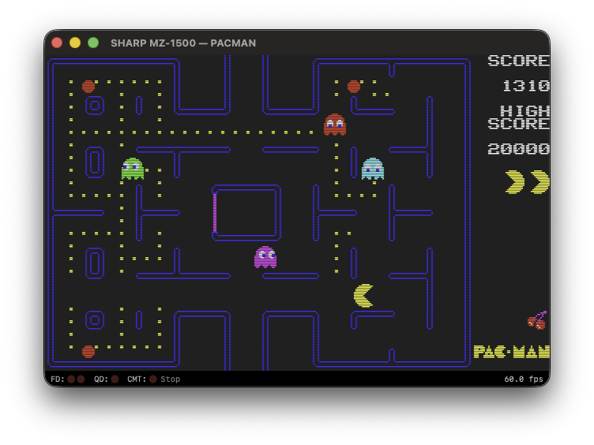
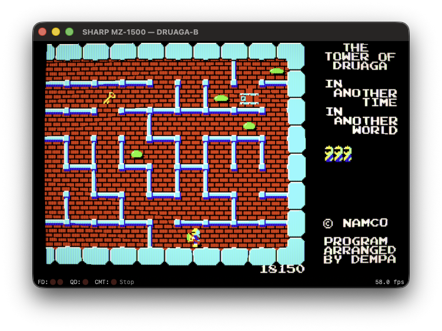

# BubiZ-1500

<p align="center">
  
</p>

[日本語](README.ja.md)

Sharp MZ-1500 Emulator for macOS


<p align="center">
  <a href="https://github.com/bubio/BubiZ-1500/releases/latest">
    
  </a>
  <a href="https://github.com/bubio/BubiZ-1500/blob/main/LICENSE">
    
  </a>
  <a href="https://github.com/bubio/BubiZ-1500/releases/latest">
    
  </a>
</p>


## About

BubiZ-1500 is a native macOS emulator for the Sharp MZ-1500 personal computer — a Japan-exclusive 8-bit machine released by Sharp in 1984.

It is based on EmuZ-1500 from the [Common Source Code Project](https://takeda-toshiya.my.coocan.jp/common/index.html) (a well-known multi-platform emulator framework by Takeda Toshiya), ported and optimized for macOS.

<p align="center"><sub><sup>Dig Dug © 1982 Namco Ltd. &nbsp;|&nbsp; MZ-1500 version © 1984 Dempa Publications, Inc. / Micomsoft Co., Ltd.</sup></sub></p>
<p align="center"></p>

<p align="center"><sub><sup>The Tower of Druaga © 1984 Namco Ltd. &nbsp;|&nbsp; MZ-1500 version © 1985 Dempa Publications, Inc. / Micomsoft Co., Ltd.</sup></sub></p>
<p align="center"></p>


## Features

- High-performance rendering via Metal
- Screen filters via Metal shaders (CRT, NTSC composite, RGB)
- Low-latency audio output via AVAudioEngine (PSG: SN76489AN ×2, PCM 1-bit)
- Audio filters (speaker simulation, reverb, chorus)
- Cycle-accurate Z80 CPU emulation
- Floppy disk / Quick Disk / cassette tape support
- Auto-detection of QD disk sets with quick switching
- State save / load
- Game controller support
- Universal Binary (Apple Silicon / Intel)

## System Requirements

- macOS 13.5 (Ventura) or later
- Apple Silicon or Intel Mac

## Install

Download the latest release from the [Releases](https://github.com/bubio/BubiZ-1500/releases) page.

> **Note**: This app is not notarized by Apple, so macOS Gatekeeper may block it on first launch. You can work around this using either of the following methods:
>
> **Option 1: Remove the quarantine flag via Terminal**
> ```bash
> xattr -cr /Applications/BubiZ-1500.app
> ```
>
> **Option 2: Allow via System Settings**
> 1. Attempt to open the app and let it get blocked
> 2. Open **System Settings** → **Privacy & Security**
> 3. Click **"Open Anyway"** next to the message about BubiZ-1500 being blocked

## Build

Open the project in Xcode and build.

```bash
open BubiZ-1500.xcodeproj
```

### Build Requirements

- Xcode Version 26.3 (17C529)
- C++17 / Swift 5

## ROM Files

Running MZ-1500 requires ROM files from the original hardware (not included in this repository).

Place the ROM files in *~/Library/Application Support/BubiZ-1500/ROM*:

```
~/Library/Application Support/BubiZ-1500
└── ROM
    ├── EXT.ROM
    ├── FONT.ROM
    └── IPL.ROM
```

## Architecture

```
Swift App (AppKit + SwiftUI)
    │
EmulatorBridge (Objective-C++)
    │
EMU Core (C++)
    ├── OSD (Objective-C++): Metal / AVAudioEngine / NSEvent
    └── VM: Z80, SN76489AN, i8253, i8255, MB8877, ...
```

## Credits

- Emulation core: [Common Source Code Project](https://takeda-toshiya.my.coocan.jp/common/index.html) by Takeda Toshiya

- NTSC Video Emulator: [NTSC Video Emulator](https://github.com/zhuker/ntsc) by [zhuker](https://github.com/zhuker)
