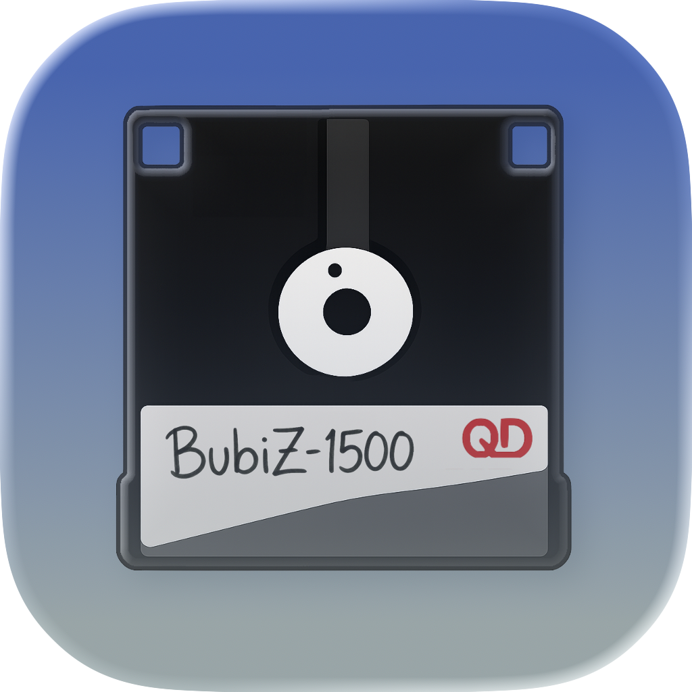
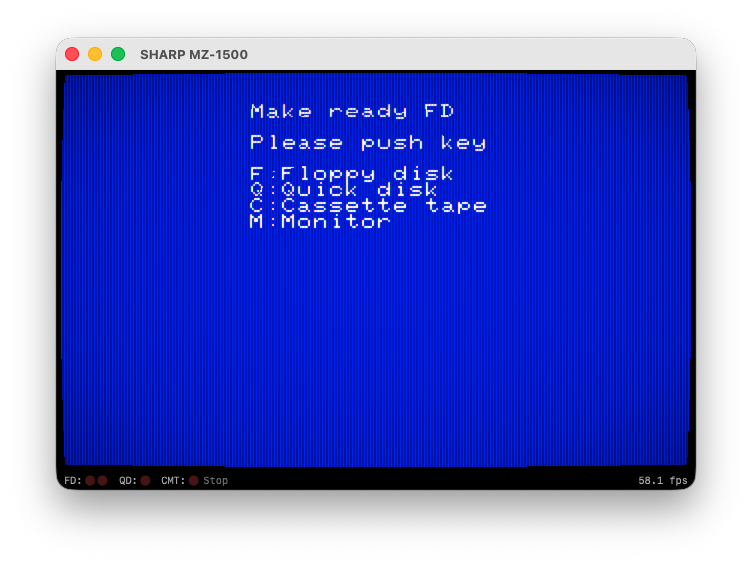

# BubiZ-1500

<p align="center">
  
</p>


Sharp MZ-1500 エミュレーター for macOS


<p align="center">
  <a href="https://github.com/bubio/BubiZ-1500/releases/latest">
    
  </a>
  <a href="https://github.com/bubio/BubiZ-1500/blob/main/LICENSE">
    
  </a>
  <a href="https://github.com/bubio/BubiZ-1500/releases/latest">
    
  </a>
</p>


## About

BubiZ-1500 は、Sharp MZ-1500 パーソナルコンピュータの macOS ネイティブエミュレーターです。
[common source code project](https://takeda-toshiya.my.coocan.jp/common/index.html)のEmuZ-1500をベースに、macOS 向けに移植・最適化しています。

<p align="center">
  
</p>


## Features

- Metal による高速な画面描画
- Metal シェーダーによる画面フィルター（CRT、NTSC コンポジット、RGB）
- AVAudioEngine による低遅延サウンド出力（PSG: SN76489AN x2、PCM1BIT）
- サウンドフィルター（スピーカーシミュレーション、リバーブ、コーラス）
- Z80 CPU エミュレーション
- フロッピーディスク / クイックディスク / カセットテープ対応
- QD ディスクセット自動検出・クイック切り替え
- ステートセーブ / ロード
- ゲームコントローラー対応
- Universal Binary（Apple Silicon / Intel）

## System Requirements

- macOS 13.5 (Ventura) 以降
- Apple Silicon または Intel Mac

## Install

[Releases](https://github.com/bubio/BubiZ-1500/releases)ページから最新版をダウンロードしてください。

> **注意**: このアプリはAppleによるノータリゼーション（公証）を受けていないため、初回起動時にGatekeeperによってブロックされる場合があります。以下のいずれかの方法で回避できます：
>
> **方法1: ターミナルで隔離フラグを削除**
> ```bash
> xattr -cr /Applications/BubiZ-1500.app
> ```
>
> **方法2: システム設定から許可**
> 1. アプリを開こうとしてブロックされた後
> 2. 「システム設定」→「プライバシーとセキュリティ」を開く
> 3. 「"BubiZ-1500"は開発元を確認できないため、使用がブロックされました」の横にある「このまま開く」をクリック

## Build

Xcode でプロジェクトを開いてビルドします。

```bash
open BubiZ-1500.xcodeproj
```

### Build Requirements

- Xcode Version 26.3 (17C529)
- C++17 / Swift 5

## ROM Files

MZ-1500 の起動には実機の ROM ファイルが必要です（本プロジェクトには含まれていません）。

ROM ファイルは*~/Library/Application Support/BubiZ-1500/ROM*に配置してください。

```
~/Library/Application Support/BubiZ-1500
└── ROM
    ├── EXT.ROM
    ├── FONT.ROM
    └── IPL.ROM
```

## Architecture

```
Swift App (AppKit + SwiftUI)
    │
EmulatorBridge (Objective-C++)
    │
EMU Core (C++)
    ├── OSD (Objective-C++): Metal / AVAudioEngine / NSEvent
    └── VM: Z80, SN76489AN, i8253, i8255, MB8877, ...
```

## Credits

- エミュレーションコア: [common source code project](https://takeda-toshiya.my.coocan.jp/common/index.html) by Takeda Toshiya

- NTSC Video Emulator: [NTSC Video Emulator](https://github.com/zhuker/ntsc) by [zhuker](https://github.com/zhuker) 
